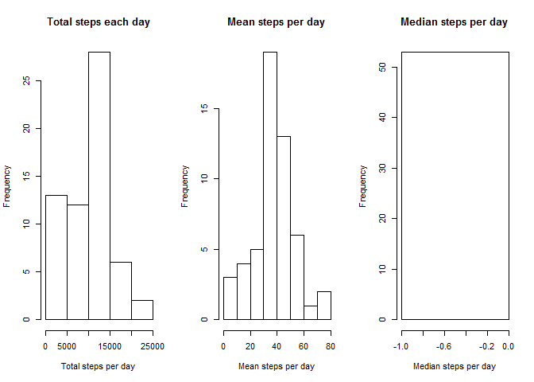
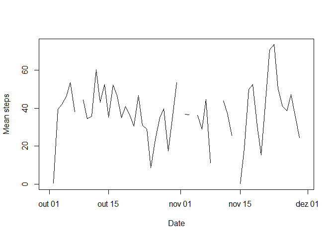
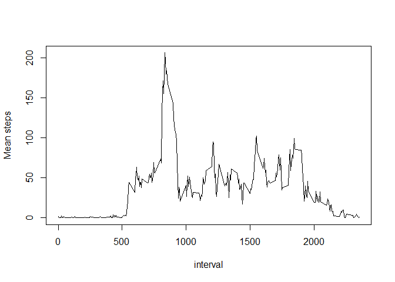
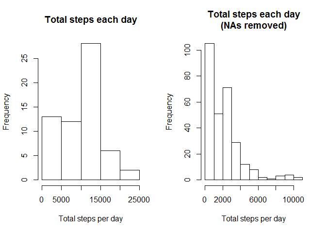
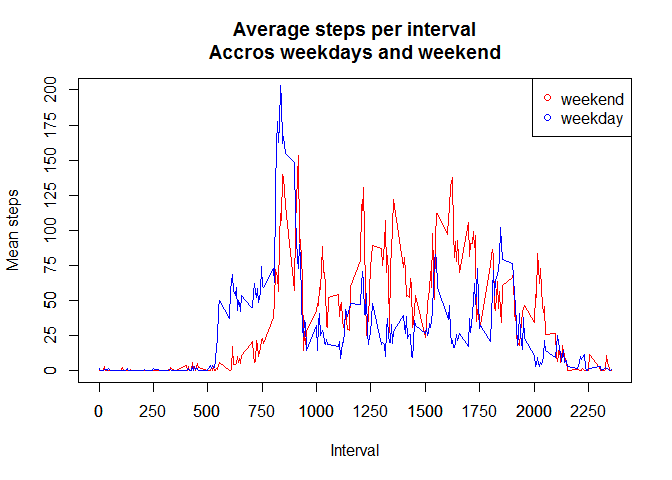

Introduction
------------

It is now possible to collect a large amount of data about personal
movement using activity monitoring devices such as a Fitbit, Nike
Fuelband, or Jawbone Up. These type of devices are part of the
"quantified self" movement - a group of enthusiasts who take
measurements about themselves regularly to improve their health, to find
patterns in their behavior, or because they are tech geeks. But these
data remain under-utilized both because the raw data are hard to obtain
and there is a lack of statistical methods and software for processing
and interpreting the data.

This assignment makes use of data from a personal activity monitoring
device. This device collects data at 5 minute intervals through out the
day. The data consists of two months of data from an anonymous
individual collected during the months of October and November, 2012 and
include the number of steps taken in 5 minute intervals each day.

Loading data
------------

    library(dplyr)
    setwd("c:/r_workspace/rep_research")
    # read dataset from activity.csv file.
    activityDataset <- read.csv('activity.csv')
    # converts the variable date from string to date.
    activityDataset$date <- as.Date(activityDataset$date, "%Y-%m-%d")

    # Summarize the data into a new dataframe (mean,sum and median) grouped by date variable
    summarizedData <- activityDataset %>% group_by(date) %>%
              summarize(meanSteps = mean(steps, na.rm = T)
                        ,totalSteps = sum(steps, na.rm = T)
                        ,medianSteps = median(steps, na.rm = T))

    head(summarizedData)

    ## # A tibble: 6 x 4
    ##         date meanSteps totalSteps medianSteps
    ##       <date>     <dbl>      <int>       <dbl>
    ## 1 2012-10-01       NaN          0          NA
    ## 2 2012-10-02   0.43750        126           0
    ## 3 2012-10-03  39.41667      11352           0
    ## 4 2012-10-04  42.06944      12116           0
    ## 5 2012-10-05  46.15972      13294           0
    ## 6 2012-10-06  53.54167      15420           0

Histogram of the total number of steps taken each day
-----------------------------------------------------

    # Plot summarized data histograms
    par(mfrow=c(1,3))
    hist(summarizedData$totalSteps, main="Total steps each day",xlab = "Total steps per day",ylab = "Frequency")
    hist(summarizedData$meanSteps, main="Mean steps per day",xlab = "Mean steps per day",ylab = "Frequency")
    hist(summarizedData$medianSteps, main="Median steps per day",xlab = "Median steps per day",ylab = "Frequency")

Time series plot of the average number of steps taken
-----------------------------------------------------

    plot(summarizedData$date,summarizedData$meanSteps,xlab="Date",ylab="Mean steps",type="l")

The 5-minute interval that, on average, contains the maximum number of steps
----------------------------------------------------------------------------

    # Get the mean of steps grouping by the variable *interval*
    stepsAverageMax <- activityDataset %>% group_by(interval) %>%
         summarize(meanSteps = mean(steps, na.rm = T))
    # print a sample of the dataset containg the interval and the mean steps
    head(stepsAverageMax)

    ## # A tibble: 6 x 2
    ##   interval meanSteps
    ##      <int>     <dbl>
    ## 1        0 1.7169811
    ## 2        5 0.3396226
    ## 3       10 0.1320755
    ## 4       15 0.1509434
    ## 5       20 0.0754717
    ## 6       25 2.0943396

    plot(stepsAverageMax$interval,stepsAverageMax$meanSteps,xlab="interval",ylab="Mean steps",type="l")

The period with higer number of steps in the observation is between
interval 750 and interval 1000. The interval 835 is peak, containing the
maximum number of steps.

    maxInterval <-  stepsAverageMax[order(-stepsAverageMax$meanSteps),]
    head(maxInterval,5)

    ## # A tibble: 5 x 2
    ##   interval meanSteps
    ##      <int>     <dbl>
    ## 1      835  206.1698
    ## 2      840  195.9245
    ## 3      850  183.3962
    ## 4      845  179.5660
    ## 5      830  177.3019

Imputing missing data
---------------------

In order to clean the dataset and reduce the bias into calculation and
summarized data, NAs will be substituted by 0.

    activityDatasetNARemoved <- activityDataset
    #Substitute all NAs values with 0
    activityDatasetNARemoved[is.na(activityDatasetNARemoved)] <- 0

    #histogram of the total number of steps taken each day and Calculate and report the mean and median total number of steps taken per day
    totalStepsNARemoved <- activityDatasetNARemoved %>% group_by(interval) %>%
         summarize(totalSteps = sum(steps, na.rm = T))

    # Plot the comparison between raw activity data ans data with NAs removed
    par(mfrow=c(1,2))
    hist(summarizedData$totalSteps, main="Total steps each day",xlab = "Total steps per day",ylab = "Frequency")
    hist(totalStepsNARemoved$totalSteps, main="Total steps each day\n(NAs removed)",xlab = "Total steps per day",ylab = "Frequency")

    # Create a dataset with Mean and Median for raw activity data and NAs removed
    comparisonDataset <- c(mean(activityDataset$steps),median(activityDataset$steps),mean(activityDatasetNARemoved$steps),median(activityDatasetNARemoved$steps))

    comparisonDataset

    ## [1]       NA       NA 32.47996  0.00000

The first two values *NA* are reffered with the raw activity data, with
NA's. The last two values are the mean and median considering the NAs
removed from the dataset.

Average number of steps taken per 5-minute interval across weekdays and weekends
--------------------------------------------------------------------------------

    # Get day of week name from *date* in dataset and set if it is weekend or weekday
    activityDatasetNARemoved$day <- ifelse(weekdays(activityDatasetNARemoved$date) %in% c("Saturday", "Sunday"), "weekend", "weekday")

    #Subset data based on day variable (weekday or weekend)
    weekdaysActivity <- activityDatasetNARemoved[activityDatasetNARemoved$day == "weekday",]
    weekendDaysActivity <- activityDatasetNARemoved[activityDatasetNARemoved$day == "weekend",]

    #Summarize the data (get mean) grouping by interval variable
    weekdaysActivityMeanSteps <- weekdaysActivity %>% group_by(interval) %>%
              summarize(meanSteps = mean(steps, na.rm = T))

    weekendActivityMeanSteps <- weekendDaysActivity %>% group_by(interval) %>%
              summarize(meanSteps = mean(steps, na.rm = T))

    #print the comparison between weekend and weekdays activity
    plot(weekendActivityMeanSteps$interval,weekendActivityMeanSteps$meanSteps,xlab="Interval",ylab="Mean steps",type="l", main="Average steps per interval\nAccros weekdays and weekend",col="red",ylim=range(0:200))
    lines(weekdaysActivityMeanSteps$interval,weekdaysActivityMeanSteps$meanSteps, type="l", col="blue")
    legend("topright",c("weekend","weekday"),col=c("red","blue"),pch=21)
    axis(1,c(0,250,500,750,1000,1250,1500,1750,2000,2250,2500))
    axis(2,c(0,25,50,75,100,125,150,175,200))

In the line chart above, it is clearly that in weekend days the activity
starts later than in weekend days and intensifies during period from
1000 and 2000. In the other hand, activity in weed days starts around
500 in average and has the peak in the 835 interval, ranges over the
period from 1250 to 2000.
